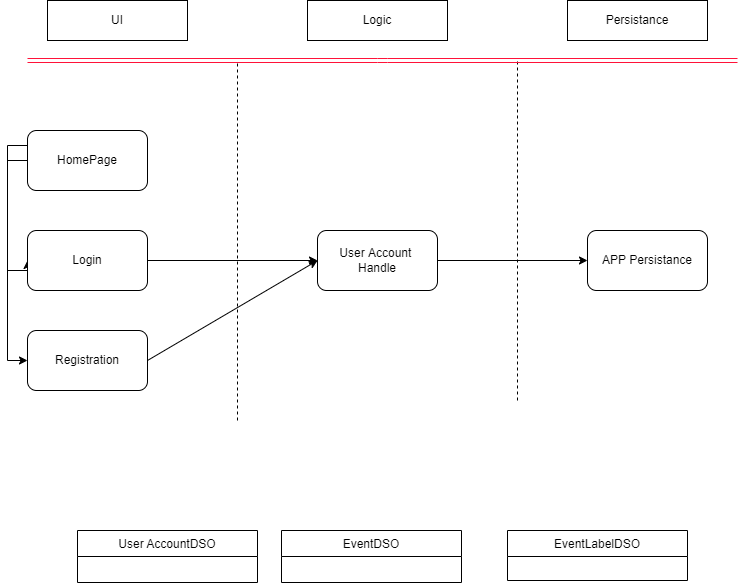

# Architecture 

Directory of classes and their layer locations. 

## Entire Project Architecture

## Iteration 1

### Presentation Layer

[HomeActivity](https://code.cs.umanitoba.ca/winter-2022-a02/group-2/time-since-a02-2/-/blob/main/app/src/main/java/comp3350/timeSince/presentation/HomeActivity.java)
- The starting screen for the app

[RegisterActivity](https://code.cs.umanitoba.ca/winter-2022-a02/group-2/time-since-a02-2/-/blob/main/app/src/main/java/comp3350/timeSince/presentation/RegisterActivity.java)
- The view for the user to register an account 

[LoginActivity](https://code.cs.umanitoba.ca/winter-2022-a02/group-2/time-since-a02-2/-/blob/main/app/src/main/java/comp3350/timeSince/presentation/LoginActivity.java)
- The view for the user to log into their account 

### Business Layer

[UserAccountManager](https://code.cs.umanitoba.ca/winter-2022-a02/group-2/time-since-a02-2/-/blob/main/app/src/main/java/comp3350/timeSince/business/UserManager.java)
- The presentation layer will call this to handle the user accounts

### Persistence Layer

[AppPersistence](https://code.cs.umanitoba.ca/winter-2022-a02/group-2/time-since-a02-2/-/blob/main/app/src/main/java/comp3350/timeSince/persistence/I_Database.java)
- Interface for the events and user accounts in the database

### Fake Database 

[FakeAppPersistence](https://code.cs.umanitoba.ca/winter-2022-a02/group-2/time-since-a02-2/-/blob/main/app/src/main/java/comp3350/timeSince/persistence/FakeDatabase.java)
- Current database implementation for events and user accounts

### Domain Specific Objects 

[Event](https://code.cs.umanitoba.ca/winter-2022-a02/group-2/time-since-a02-2/-/blob/main/app/src/main/java/comp3350/timeSince/objects/EventDSO.java)
- The event object

[EventLabel](https://code.cs.umanitoba.ca/winter-2022-a02/group-2/time-since-a02-2/-/blob/main/app/src/main/java/comp3350/timeSince/objects/EventLabelDSO.java)
- Object for the tags / labels of an event 

[UserAccount](https://code.cs.umanitoba.ca/winter-2022-a02/group-2/time-since-a02-2/-/blob/main/app/src/main/java/comp3350/timeSince/objects/UserDSO.java)
- The user / user account object
